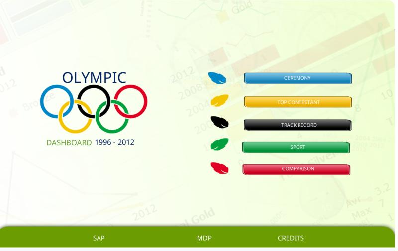
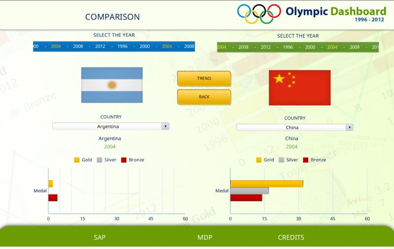
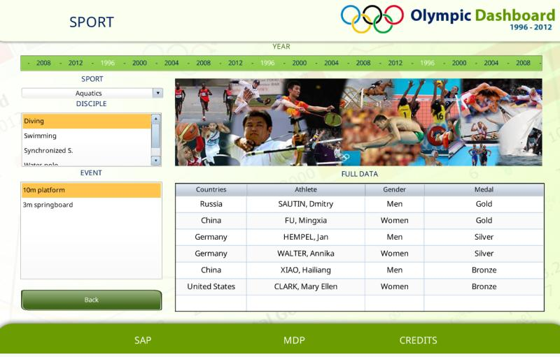
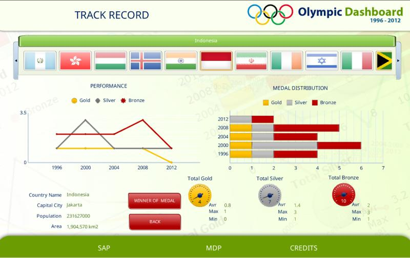
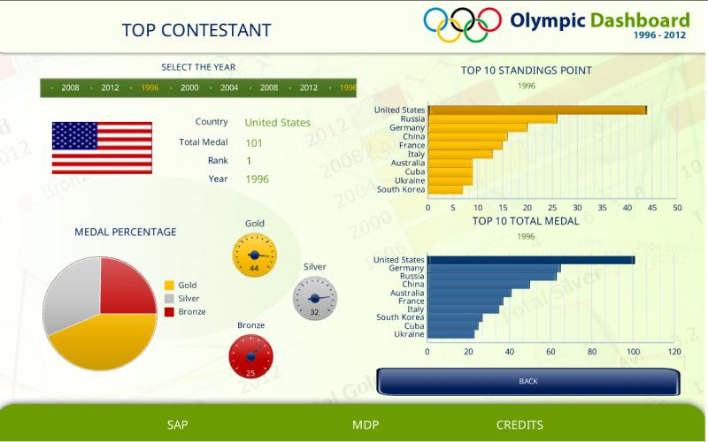

# 🏆 SAP Olympic Dashboard (Southeast Asia Champion – 2012)

> 🚀 **1st Place Winner of the SAP BI/BO Southeast Asia Dashboard Competition**

This project presents an award-winning **interactive Olympic Games dashboard** built using **SAP BusinessObjects (BI/BO) Dashboard xCelsius**. It visualizes historical Olympic data from **1996 to 2012**, offering users the ability to explore the games from various analytical perspectives.

Created by the **Teddy Brothers** (Hernando Ivan Teddy & Albert Prasetia Teddy) from **STMIK MDP & MDP Business School**, this dashboard was crowned **Champion of Southeast Asia** among 150+ competing teams.

📌 **Live Demo**: [View Dashboard Online](https://ndoteddy.github.io/ndo-sea-dashboard-sap-2012/)

---

## 📣 About the Competition

> “All undergraduate students from tertiary institutions in Indonesia, Malaysia, The Philippines, Singapore, Thailand, and Vietnam were invited to participate. Each team had to create an interactive dashboard to analyze Olympic Games results from 1996–2012. Judging was based on **usefulness**, **usability**, **data quality**, and **documentation**.”
> — [SAP Student Council Announcement](http://scn.sap.com/community/uac/student-council/blog/2012/07/24/apj-sap-dashboard-design-competition-2012-southeast-asia-sep-to-nov-2012)

**Program:** SAP Dashboard xCelsius / Business Intelligence (BI/BO)
**Dataset Size:** \~9,800 rows per page of Olympic data (spanning 1996–2012)

---

## 🥇 Southeast Asia Finalists

| Country          | Team Name          | Institution                     | Department              |
| ---------------- | ------------------ | ------------------------------- | ----------------------- |
| 🇻🇳 Vietnam     | A+                 | Foreign Trade University HCM    | Business Administration |
| 🇲🇾 Malaysia    | Galaxy             | Tunku Abdul Rahman College      | Arts and Science        |
| 🇵🇭 Philippines | Kasoy              | Asia Pacific College            | Computer Science and IT |
| 🇸🇬 Singapore   | Leverage           | Nanyang Polytechnic             | Information Technology  |
| 🇮🇩 Indonesia   | **Teddy Brothers** | STMIK MDP & MDP Business School | Information Technology  |
| 🇹🇭 Thailand    | XCSP               | Rangsit University              | Information Technology  |

> 🏅 **Grand Winner**: Teddy Brothers (Indonesia)
> 📅 **Final Judging Date**: December 7, 2012

---

## 📊 Dashboard Highlights

The Olympic Games produce vast amounts of data. This dashboard helps turn complex statistics into clear, meaningful visuals. Key features include:

* 🌐 Country-based medal performance
* 🏋️ Sport-by-sport breakdown
* 👥 Athlete highlights
* 📈 Historical medal trends (1996–2012)
* 💡 Insightful comparisons across years and regions

---

## 🧑‍💻 Technologies Used

* **SAP BusinessObjects Dashboard (xCelsius)**
* Microsoft Excel (data source)
* SAP BI Suite
* Custom visual scripting
* Integration with Microsoft Office

---

## 🧠 Skills Demonstrated

* Dashboard Design & Interactivity
* Business Intelligence & Data Visualization
* Data Cleaning & Modeling
* Analytical Thinking
* Presentation & Storytelling

---

## 📁 Repository Content

```bash
📁 /assets      # Screenshots or sample dashboard images
📁 /presentation # Final pitch or documentation files
📄 README.md    # This file
```

---

## 📸 Screenshots









---

## 🧑‍🤝‍🧑 Team Members

**Hernando Ivan Teddy**
**Albert Prasetia Teddy**
🏫 STMIK MDP & MDP Business School — Indonesia

---

